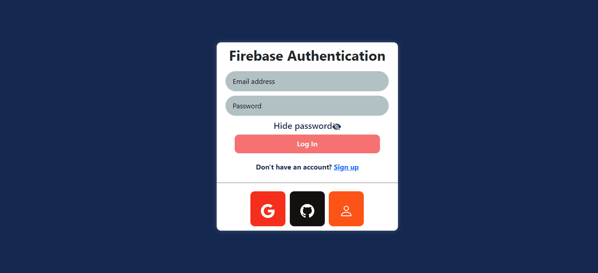
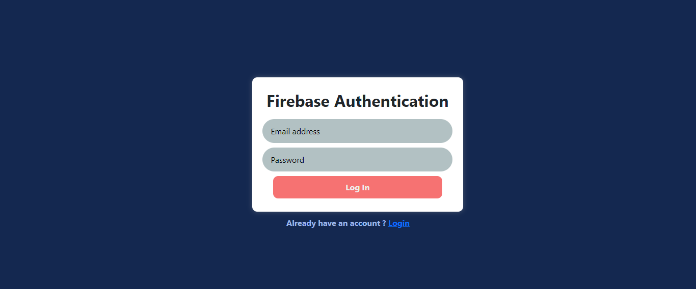

<h1 align=center>Firebase Authentication</h1>

   

### This is fully functional authentication page using **Firebase**. We can sign in using _Google_, _GitHub_, _Anonymously_, _Email_. If you don't have existing account you can also create a new account from signup page. Login page also has option to hide and show the password.

### Tech Stack :

-   ### React
-   ### Firebase
-   ### Router
-   ### [LIVE](https://authusingfirebase.netlify.app/)

---

#### Login Page

## 

#### Signup Page

---

#### Home Page

---

---

### Contact me:

[Twitter](https://twitter.com/Vanshsh2701)

[LinkedIn](https://www.linkedin.com/in/vanshsharma27/)
